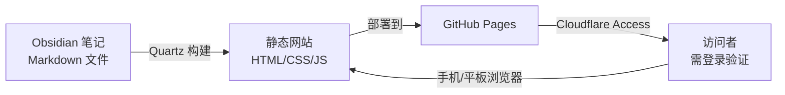

# Obsidian 笔记 → 私密博客方案

## 概述

使用 **Quartz** 将 Obsidian 笔记转换为静态网站，部署到 **GitHub Pages**，通过 **Cloudflare Access** 实现私密访问（免费）。



---

## 整体架构

| 组件 | 用途 | 费用 |
|------|------|------|
| **Quartz** | 将 Markdown 转成网站 | 免费开源 |
| **GitHub Pages** | 托管网站 | 免费 |
| **Cloudflare Access** | 访问控制（私密） | 免费版可用 |
| **Node.js** | 运行 Quartz 构建工具 | 免费 |

---

## 实施步骤

### 第 1 步：安装 Node.js

```bash
# 使用 Homebrew 安装 Node.js
brew install node

# 验证安装
node --version
npm --version
```

### 第 2 步：在 Obsidian Vault 中初始化 Quartz

```bash
# 进入你的 Obsidian Vault 目录
cd /Users/lain/Documents/Obsidian/MyNotes

# 克隆 Quartz 模板（不要用 git clone，用 npx 方式）
npx quartz create

# 按照提示选择：
# - 选择 "Quartz v4" 最新版本
# - 选择 "Empty Quartz"（从头开始）
```

### 第 3 步：配置 Quartz

编辑 `quartz.config.ts` 文件，配置网站名称、描述等：

```ts
// quartz.config.ts
const config: GlobalConfiguration = {
  title: "我的笔记",          // 网站标题
  description: "个人学习笔记",  // 网站描述
  locale: "zh-CN",            // 中文
  // ... 其他配置保持默认
}
```

### 第 4 步：构建并本地预览

```bash
# 构建网站
npx quartz build

# 本地预览（可选）
npx quartz serve
# 浏览器打开 http://localhost:8080 查看效果
```

### 第 5 步：部署到 GitHub Pages

```bash
# 设置 GitHub Pages 远程仓库
# 创建一个新的 GitHub 仓库，名为：你的用户名.github.io
# 例如：lain.github.io

git remote add origin https://github.com/你的用户名/你的用户名.github.io.git
git branch -M main
git push -u origin main
```

然后在 GitHub 仓库设置中：
1. 进入 **Settings** → **Pages**
2. **Source** 选择 `GitHub Actions`
3. Quartz 会自动创建 GitHub Actions 工作流文件

### 第 6 步：配置 Cloudflare Access（私密访问）

1. 在 Cloudflare 注册免费账号：https://dash.cloudflare.com/sign-up
2. 将你的域名 DNS 托管到 Cloudflare（或者用 Cloudflare 提供的临时域名）
3. 进入 **Cloudflare Zero Trust** → **Access** → **Applications**
4. 添加一个新应用：
   - **Application name**: `obsidian-blog`
   - **Domain**: 你的域名（如 `notes.你的域名.com`）
   - **Policy**: 设置登录方式（如 Google 账号、GitHub 账号、邮箱验证码等）
5. 在 DNS 设置中添加 CNAME 记录，指向 `你的用户名.github.io`

> 💡 **免费替代方案**：如果 Cloudflare 配置太复杂，也可以直接用 **Vercel** 部署，它自带 **Password Protection**（密码保护），一键开启，更简单。

---

## 日常使用流程

### 写笔记 → 自动更新博客

1. 在 Obsidian 中写笔记（和平常一样）
2. 运行部署命令：
   ```bash
   cd /Users/lain/Documents/Obsidian/MyNotes
   npx quartz build
   git add .
   git commit -m "更新笔记"
   git push
   ```
3. 等待 1-2 分钟，GitHub Actions 自动部署
4. 手机/平板浏览器打开网址即可查看

> 💡 **自动化**：可以配置 GitHub Actions 实现「推送即部署」，这样你只需要 `git push` 即可。

### 手机/平板上查看

- 不需要安装任何 App
- 浏览器打开你的博客网址
- 通过 Cloudflare Access 登录验证后即可查看
- 支持全文搜索、分类浏览、双向链接导航

---

## Quartz 特色功能

| 功能 | 说明 |
|------|------|
| **全文搜索** | 支持搜索所有笔记内容 |
| **双向链接** | Obsidian 的 `[[链接]]` 自动转为可点击的页面链接 |
| **图谱视图** | 笔记之间的关系可视化 |
| **目录导航** | 自动生成文章目录 |
| **暗色模式** | 支持亮色/暗色切换 |
| **响应式设计** | 手机、平板、电脑都适配 |
| **标签系统** | 支持标签分类 |
| **Latex 公式** | 支持数学公式渲染（适合你的数学笔记） |

---

## 注意事项

1. **公开 vs 私密**：目前通过 Cloudflare Access 实现私密访问，未来想公开时只需关闭 Access 策略即可
2. **域名**：如果你有自己的域名，绑定后体验更好；没有的话可以用 `你的用户名.github.io`
3. **构建时间**：笔记越多，构建时间越长，一般几百篇笔记在 1-2 分钟内完成
4. **图片资源**：笔记中的图片需要放在 `content/` 目录下才能正常显示

---

## 下一步

1. 安装 Node.js
2. 在 Obsidian Vault 中初始化 Quartz
3. 配置并构建网站
4. 部署到 GitHub Pages
5. 配置 Cloudflare Access 私密访问
