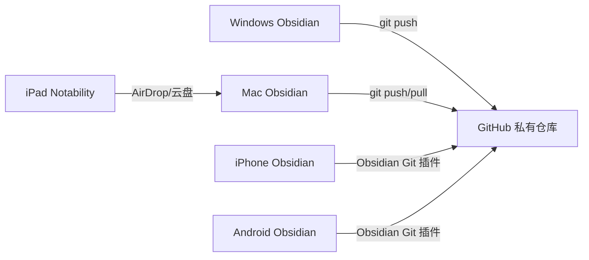

# Obsidian 笔记多端同步方案

## 概述

使用 **Git + GitHub** 实现 Obsidian 笔记在 **Windows → Mac → 手机（安卓/苹果）** 三端同步，零成本、安全可靠。

---

## Part 1：Mac 端配置（先做这个）

### 1.1 检查 Git 是否安装

打开 Mac 的 **终端（Terminal）**，输入：

```bash
git --version
```

- 如果显示版本号（如 `git version 2.39.3`），说明已安装 ✅
- 如果提示 `command not found`，需要安装 Git：
  - 方式一：安装 Xcode Command Line Tools
    ```bash
    xcode-select --install
    ```
  - 方式二：从 https://git-scm.com/downloads 下载安装

### 1.2 配置 Git 用户信息

```bash
git config --global user.name "你的GitHub用户名"
git config --global user.email "你注册GitHub的邮箱"
```

### 1.3 在 GitHub 上创建仓库

1. 浏览器打开 https://github.com 并登录你的账号
2. 点击右上角 **+** → **New repository**
3. 填写：
   - **Repository name**: `obsidian-vault`（或你喜欢的名字）
   - **Description**: 可选，如「我的 Obsidian 笔记」
   - **Public 或 Private**：建议选 **Private**（私密，笔记不外泄）
   - **不要勾选** "Add a README file"、"Add .gitignore"、"Choose a license"
4. 点击 **Create repository**
5. 创建后会看到一个页面，复制 **远程仓库地址**，类似：
   ```
   https://github.com/你的用户名/obsidian-vault.git
   ```

### 1.4 在 Mac 上创建 Obsidian Vault 并关联 GitHub

1. 打开 Obsidian
2. 点击 **Create new vault** → **Create**
   - **Vault name**: 输入你喜欢的名字（如 `MyNotes`）
   - **Location**: 选择一个好记的位置，例如 `/Users/lain/Documents/Obsidian/MyNotes`
3. 创建完成后，关闭 Obsidian（先别急着写笔记）

### 1.5 初始化 Git 仓库并推送到 GitHub

打开终端，进入你的 Vault 目录：

```bash
cd /Users/lain/Documents/Obsidian/MyNotes
```

初始化 Git：

```bash
git init
```

创建 `.gitignore` 文件，排除 Obsidian 的缓存文件：

```bash
echo ".obsidian/workspace" > .gitignore
echo ".obsidian/cache" >> .gitignore
echo ".trash/" >> .gitignore
```

添加所有文件并提交：

```bash
git add .
git commit -m "初始化 Obsidian 笔记库"
```

关联远程仓库并推送：

```bash
git remote add origin https://github.com/你的用户名/obsidian-vault.git
git branch -M main
git push -u origin main
```

> ⚠️ 如果提示要输入 GitHub 用户名和密码，**密码不是登录密码**，而是 **Personal Access Token**（个人访问令牌），下面会说明如何创建。

### 1.6 创建 GitHub Personal Access Token（免密推送）

1. 浏览器打开 https://github.com/settings/tokens
2. 点击 **Generate new token** → **Generate new token (classic)**
3. 填写：
   - **Note**: `obsidian-sync`
   - **Expiration**: 选 `No expiration`（永不过期）
   - **Scopes**: 勾选 `repo`（全部权限）
4. 点击 **Generate token**
5. **复制生成的 token**（关掉页面后就看不到了！）
6. 以后推送时，用户名填你的 GitHub 用户名，密码填这个 token

> 💡 **进阶：配置 SSH 免密登录（推荐）**
> ```bash
> ssh-keygen -t ed25519 -C "你的邮箱"
> # 一路回车
> cat ~/.ssh/id_ed25519.pub
> # 复制输出的内容
> ```
> 然后打开 https://github.com/settings/keys → **New SSH key** → 粘贴 → 保存
> 之后远程地址改用 SSH 格式：
> ```bash
> git remote set-url origin git@github.com:你的用户名/obsidian-vault.git
> ```

---

## Part 2：Windows 端配置

### 2.1 找到 Windows 上的 Obsidian 笔记库

1. 打开 Obsidian
2. 左下角点击 **设置图标（⚙️）**
3. 查看 **关于 → 仓库路径**，这就是你的 Vault 路径
   - 通常类似 `C:\Users\你的用户名\Documents\Obsidian\你的Vault名`

### 2.2 安装 Git（如果没装）

1. 下载：https://git-scm.com/downloads
2. 安装时全部默认选项即可
3. 安装完成后，打开 **Git Bash**（或 cmd）

### 2.3 配置 Git 并拉取笔记

```bash
# 配置用户信息（和 GitHub 一致）
git config --global user.name "你的GitHub用户名"
git config --global user.email "你注册GitHub的邮箱"

# 进入笔记目录
cd "C:\Users\你的用户名\Documents\Obsidian\你的Vault名"

# 初始化 Git
git init

# 关联远程仓库
git remote add origin https://github.com/你的用户名/obsidian-vault.git

# 拉取 Mac 上已推送的内容
git pull origin main --allow-unrelated-histories
```

> ⚠️ 如果 Windows 上已有笔记，会与拉取的内容合并。如果 Windows 是空白的新 Vault，则直接拉取成功。

### 2.4 将 Windows 现有笔记推送到 GitHub

如果 Windows 上已有笔记内容：

```bash
# 添加所有文件
git add .

# 提交
git commit -m "添加 Windows 端笔记"

# 推送到 GitHub
git push origin main
```

---

## Part 3：手机端访问

### 3.1 iPhone / iPad 端

**方案 A：使用 Obsidian Git 插件（推荐，免费）**

1. App Store 下载 **Obsidian**（免费）
2. 创建同名 Vault（如 `MyNotes`）
3. 安装插件：
   - 设置 → 社区插件 → 关闭安全模式
   - 浏览 → 搜索 **Obsidian Git** → 安装并启用
4. 配置插件：
   - 设置 → Obsidian Git
   - **GitHub 仓库地址**: `https://github.com/你的用户名/obsidian-vault.git`
   - **GitHub 用户名**: 你的 GitHub 用户名
   - **GitHub Token**: 上面创建的 Personal Access Token
   - **Pull updates on startup**: 开启（启动时自动拉取）
   - **Push on commit**: 开启（提交时自动推送）
5. 手动拉取：命令面板（Cmd+P）→ `Obsidian Git: Pull`
6. 手动推送：命令面板 → `Obsidian Git: Push`

**方案 B：使用 Working Copy App（更稳定）**

1. App Store 下载 **Working Copy**（免费版够用）
2. 在 Working Copy 中克隆你的 GitHub 仓库
3. 在 Obsidian 中打开这个本地文件夹作为 Vault
4. 编辑笔记后，回到 Working Copy 提交并推送

### 3.2 Android 端

1. 安装 **Obsidian**（Google Play 或官网 APK）
2. 安装 **MGit** 或 **Termux** 用于 Git 操作
3. 安装 **Obsidian Git** 插件（同上）
4. 配置方式与 iPhone 端一致

---

## Part 4：日常使用流程

### 4.1 在 Mac 上写笔记

```bash
# 打开终端，进入 Vault 目录
cd /Users/lain/Documents/Obsidian/MyNotes

# 查看变更状态
git status

# 添加所有变更
git add .

# 提交
git commit -m "更新笔记：xxx"

# 推送到 GitHub
git push origin main
```

> 💡 **偷懒技巧**：可以写一个简单的脚本 `sync.sh`：
> ```bash
> #!/bin/bash
> cd /Users/lain/Documents/Obsidian/MyNotes
> git add .
> git commit -m "自动同步 $(date '+%Y-%m-%d %H:%M')"
> git push origin main
> ```
> 然后给执行权限：`chmod +x sync.sh`
> 每次写完笔记运行：`./sync.sh`

### 4.2 在其他设备上获取最新笔记

- **Mac/Windows**：`git pull origin main`
- **手机**：打开 Obsidian → 命令面板 → `Obsidian Git: Pull`

---

## Part 5：Notability iPad → Mac 文件传输

由于不想用 iCloud，推荐以下免费方案：

### 方案 A：AirDrop（最简单，无需网络）

1. **iPad 和 Mac** 确保都开启了蓝牙和 Wi-Fi
2. **iPad 上**：
   - 打开 Notability
   - 选择要导出的笔记
   - 点击 **分享按钮** → **AirDrop**
   - 选择你的 Mac
3. **Mac 上**：
   - 文件会自动保存到 **下载** 文件夹
   - 格式为 PDF，可以拖入 Obsidian 或其他笔记软件

### 方案 B：OneDrive / Google Drive（跨平台，自动同步）

1. **iPad 上**：
   - 安装 OneDrive 或 Google Drive
   - 在 Notability 中导出笔记 → 选择「存储到文件」
   - 选择 OneDrive 或 Google Drive 目录
2. **Mac 上**：
   - 安装同样的云盘客户端
   - 文件会自动同步到 Mac

### 方案 C：LocalSend（开源，局域网传输）

1. iPad 和 Mac 都安装 **LocalSend**（免费开源）
2. 在同一 Wi-Fi 下即可互传文件
3. 下载：https://localsend.org

---

## 注意事项

### ✅ 一定要做的
- **.gitignore** 配置好，避免提交缓存文件
- **定期推送**，养成写完笔记就 `git push` 的习惯
- **Private 仓库**，笔记是私密内容
- **手机端先拉取再编辑**，避免冲突

### ⚠️ 避免冲突的建议
- 不要在同一时间在不同设备上编辑同一个文件
- 如果出现冲突，Git 会提示，需要手动解决
- 手机端建议只读为主，编辑后及时推送

### 🔄 同步流程图



---

## 下一步行动

1. ✅ **现在**：在 Mac 上打开终端，运行 `git --version` 检查 Git
2. ✅ **然后**：打开 Obsidian 创建 Vault
3. ✅ **接着**：在 GitHub 上创建仓库
4. ✅ **最后**：按上述步骤一步步配置

如果有任何步骤遇到问题，随时告诉我！
